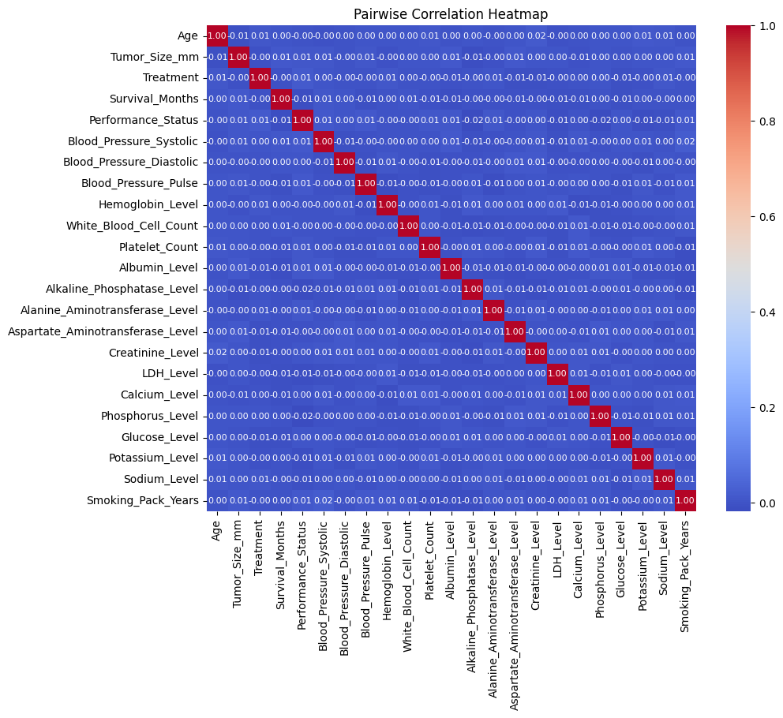

# Fine-tuning CARTE for lung cancer treatment classification

Ayoub Kachkach

## Goal

`/lung_cancer_data.csv` is a ~12k-row dataset of various health and lifestyle indicators for patients at different stages of lung cancer. The learning task is to predict the right treatment (chemo, surgery, ...) based on the patient's indicators.

The goal of this report is to come up with improvements to **CARTE 0.0.24** that would:

- +10% in classification metrics (measured by AUC).
- -20% in memory usage.
- -20% in runtime.

on this particular task. `./task.pdf` contains the full task description.

## Setting a baseline

> **⚠️ Note**: training on GPU was broken initially, but then fixed in https://github.com/soda-inria/carte/commit/adfef5881ad0f454376b5e8d93ca52308a22e2bd.

A first run of CARTE with default hyperparameters on the dataset gives a AUROC of ~0.5 -- equivalent to a random classifier. The model is clearly not learning anything useful. Attempts at getting baselines with simpler models like XGBoost, sweeping over 100 different configurations, again always gives an AUROC of ~0.5 as well. The same stays true even after doing some basic preprocessing like removing the 'Patient_ID' column, or fixing rows in which the "Smoking_Pack_Years" column has non-zero values where "Smoking History" is set to "Never Smoked".

### Taking a closer look at the data

(see `/data_analysis.ipynb` for the all the plots)

Plotting the distribution of numerical values, we can see that they are almost perfectly uniformly distributed:

The pair-wise correlation matrix shows that there is absolutely no correlation between any of the features (even for things where there should be, like 'Age' and 'Survival_Months')

My hunch is that this dataset is composed of completely independently random values (probably synthetic), and that there are no patterns to learn from it. The +10% AUC goal is therefore impossible to reach on this dataset, and I will redirect my efforts on the other goals.

## Reducing runtime+memory usage

### Inference

#### Current state

Running inference using CARTE the first time locally put my computer (16GB RAM) to its knees. I ran a profiler to get a sense of how much memory was being used:

Running [memray](https://github.com/bloomberg/memray) to get a more detailed view shows that most of the memory was used by the 7.5GB FastText model that is fully loaded in memory:
.
We can see the interactive flamegraph in `./flamegraph.html`.

The FastText model is loaded when the rows->graph preprocessor is fit as a class attribute ([here](https://github.com/soda-inria/carte/blob/adfef5881ad0f454376b5e8d93ca52308a22e2bd/carte_ai/src/carte_table_to_graph.py#L223)), and is kept in memory for the whole duration of the inference process.

#### Solution

##### **Alternative 1: Lazy loading**

One approach would be to free the FastText model from memory after the preprocessor is fit, and reload it on-demand when we need to do inference. This would reduce the overall memory footprint but would still (1) keep the same peak memory usage (requiring us to still serve this on a high-RAM machine), and (2) tradeoff memory with speed as loading the whole model from disk takes ~40s.

**Conclusion:** this doesn't solve the problem.

##### **Alternative 2: Preprocess table once and cache embeddings**

We could fit our table->graph preprocessor once with the in-memory FastText model but free it immediately and instead cache all embeddings we calculated (for all col names + categorical values in our dataset). We could then use these cached embeddings at inference time instead of loading the whole model.

This however limits CARTE to only processing in-vocab categorical values (those seen and cached while training the preprocessor). Example: we won't be able to handle a high-variance column like a free-text "Doctor's Notes" since it is impossible to preprocess and cache. The ability of handling out-of-vocab values is one of the core stated missions of CARTE and we shouldn't compromise on it.

**Conclusion:** this doesn't solve the problem.

##### **Solution: export FastText to disk in fast-read format**

CARTE only does lookups of very specific words in the FastText model. It doesn't do any expensive operations like knn search which would warrant loading the whole vocab in memory. We can therefore afford to re-export the FastText model to disk in a <k,v>-friendly format, and only load the embeddings we need on-demand.

We went with [LMDB](https://en.wikipedia.org/wiki/Lightning_Memory-Mapped_Database) as it seemed to offer the fastest reads + lowest overhead in storage. We also wrote a new `FastText` class that can read from this store on-demand instead of loading everything in memory.

Conclusion: With this, we reduce the memory footprint of FastText at inference time from 7.5GB to ~0GB and achieve the following:

- 63% reduction in peak memory usage => we can use smaller/cheaper machines for serving.
- 90% reduction in total memory usage => less costs if we pay per resources used.
- 3x speedup preprocessing training data (see figure) and comparable latency processing random rows at inference (see profiler.py).

# Long-term improvements

As mentioned earlier, this dataset doesn't seem to be something any model can learn from. However, from my initial interactions with CARTE, it seems like there is a lot of room for improvement.

### **1. A better encoder**

The current FastText model is very primitive, especially compared to current state-of-the-art. It relies on basic embedding lookups. To generate embeddings for a sentence, it averages embeddings for every word. This very naive approach would produce the same embeddings for "Price Weight Ratio" and "Weight Price Ratio" even though the column values represent totally different quantities.

It also doesn't handle words with underscores well. In the lung cancer table, we have col names like "Smoking*Pack_Years" which are treated as a single word by FastText. Since they're out of vocab, it splits them into 5-grams "Smoki", "mokin", "oking", "king*", "ing_P", ... and averages that. It's not only about inference-time but also maximizing learning during pre-training. the YAGO KG that CARTE is pre-trained on also has labels that are camel-case (e.g. "influencedBy") and would suffer from the same issue.

Using something like BERT to pre-train the foundational CARTE model would provide a huge boost in my opinion.

### **2. More pre-training stages with tabular data**

The current CARTE model is pre-trained on a KG alone. This allows the model to understand relations between entities in the world, but not learn from other things specific to tabular data. We could collect a large sample of high quality tabular data and include them in the pre-training regime.

### **3. RAG at inference time**

CARTE support multi-table joins at inference time. This is a very powerful feature but it's not used in the current task. We could pull "similar tables" to queried table from a store of high quality tabular data and include them in the fine-tuning run to maximize transfer.
